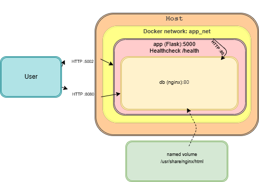

[](https://github.com/nugusu20/DevOps-Linux/actions/workflows/docker-ci.yml)
# Week 6 – Docker & Containers
**Current version:** v1.0.1  
**Based on Week 5:** ../week5

## Quickstart
```bash
docker compose up -d --build
curl -I http://localhost:5002   # app (Flask) → 200 OK
curl -I http://localhost:8080   # db  (nginx) → 200 OK
```

## Architecture


---

<details>
<summary><strong>Daily Practice – Tasks 1–7 (click to expand)</strong></summary>

### Task 1 – Introduction to Docker CLI
**Goal:** Understand core objects (Images, Containers) and their lifecycle.
```bash
# First run
docker run hello-world

# Basic listings
docker ps                      # running containers
docker ps -a                   # all containers (including exited)
docker images                  # local images

# Stop / remove
docker stop <CONTAINER_ID|NAME>
docker rm   <CONTAINER_ID|NAME>
docker rmi  <IMAGE_ID|NAME:TAG>
```
**Why:** Build intuition of Image → Container and the day‑to‑day CLI.

---

### Task 2 – Working with Images & Ports (nginx)
**Goal:** Pull & run images, expose ports host↔container.
```bash
# Pull & run nginx (default tag)
docker pull nginx:latest
docker run -d --name web1 -p 8080:80 nginx:latest
curl -I http://localhost:8080

# Bonus: lighter image
docker pull nginx:alpine
docker run -d --name web2 -p 8081:80 nginx:alpine

# Compare sizes
docker image ls nginx --format 'table {{.Repository}}\t{{.Tag}}\t{{.Size}}'
```
**Why:** Understand host:container port mapping and why alpine images are smaller.

---

### Task 3 – Dockerfile Basics (Flask “Hello from Docker”)
**Goal:** Write a slim, cache‑efficient Dockerfile + .dockerignore.
```bash
# (Already present in this repo)
# Dockerfile (key lines):
# FROM python:3.12-slim
# WORKDIR /app
# COPY requirements.txt .
# RUN pip install --no-cache-dir -r requirements.txt
# COPY src/ /app/
# EXPOSE 5000
# HEALTHCHECK --interval=10s --timeout=2s --retries=3 CMD curl -fsS http://127.0.0.1:5000/health || exit 1
# CMD ["python", "app.py"]

# Build & run
docker build -t myflask:dev .
docker run -d --name app1 -p 5000:5000 myflask:dev
curl -I http://localhost:5000

# .dockerignore (example)
# __pycache__/
# *.pyc
# .git
```
**Why:** Correct layer order preserves cache; small base (`slim`) reduces image size.

---

### Task 4 – Custom Networking & Multi‑container
**Goal:** Internal networking and service‑name DNS.
```bash
# Manual network (example)
docker network create mynet
docker run -d --name db  --network mynet nginx:alpine
docker run -d --name web --network mynet nginx:alpine
docker exec db ping -c 1 web   # service name resolves via Docker DNS

# In Compose it’s automatic with a user-defined network (app_net)
docker compose up -d
docker compose exec app sh -lc 'wget -qS -O- http://db | head -n 3'
```
**Why:** Services on the same user‑defined network can talk via names, no hardcoded IPs.

---

### Task 5 – Docker Compose Intro
**Goal:** Orchestrate multi‑service app with one file.
```bash
docker compose up -d --build
docker compose ps
docker compose logs --tail=50 app
docker compose down
```
**Why:** Single source of truth for services, networks, volumes, env, and ports.

---

### Task 6 – Monitoring & Logging Basics
**Goal:** Health endpoints and logs for visibility.
```bash
# App health (HTTP 200/500)
curl -i http://localhost:5002/health

# Docker health status
docker inspect -f 'Health={{.State.Health.Status}}' $(docker compose ps -q app)

# Logs
docker logs <container>
docker compose logs --tail=100 app
```
**Why:** Know when the service is healthy and how to debug.

---

### Task 7 – Advanced Docker Features
**Goal:** Image tags (SemVer) + Alpine variant.
```bash
# Tag images
docker build -t myflask:1.0.1 .
docker tag myflask:1.0.1 myflask:latest
docker images myflask

# Optional: alpine variant (if you keep an alternate Dockerfile)
# docker build -f Dockerfile.alpine -t myflask:alpine .
# docker run -d --name app-alpine -p 5003:5000 myflask:alpine
```
**Why:** Avoid deploying `latest`; prefer explicit SemVer tags. Explore lighter bases.
</details>

---

<details>
<summary><strong>Week 6 – Summary Task (click to expand)</strong></summary>

### Step 1 – Flow Diagram
- Architecture diagram checked in: `diagram/architecture.png`  
- Source for edits: `diagram/architecture.drawio`

### Step 2 – Dockerize Your Project
- Slim base: `python:3.12-slim`
- Cache‑friendly order: copy `requirements.txt` → `pip install` → copy `src/`

### Step 3 – Compose & Networking
- Two services (`app`, `db`) on the same custom network (`app_net`)
- Ports: `5002:5000` (app) and `8080:80` (db)
- Named volume mapped to nginx static content (if used)

### Step 4 – Healthchecks & Tags
- `/health` endpoint returns 200 (OK) or 500 (fail path)
- `HEALTHCHECK` in Dockerfile probes `/health`
- Image tags: `myflask:1.0.1` (and optionally `latest`)
- (Recommended) Git tag: `v1.0.1`

### Step 5 – GitHub Actions (CI)
- Workflow in `.github/workflows/docker-ci.yml` builds → runs → curls `/health`
- (Optional) Slack/Discord notifications via repository secrets:
  - `SLACK_WEBHOOK_URL` / `DISCORD_WEBHOOK_URL`
  - Then add a final `curl` step on success/failure

### Step 6 – Update README
- Quickstart commands
- Embedded architecture diagram
- Link back to Week 5 code: `../week5`
- (Optional) “Current version: v1.0.1”

### Step 7 – Submission Instructions
- Open a PR “Week 6 Summary”; ensure CI is green; merge to `main`
- Ensure all changes landed via PRs

#### ✅ Checklist Before Submission
- [x] Flow diagram created and embedded
- [x] Dockerfile present and lightweight
- [x] docker-compose.yml manages both services
- [x] Healthcheck and image tags added
- [x] CI pipeline builds, runs, and probes health
- [x] README updated and clear
- [x] All code submitted via Pull Requests
</details>

---

<details>
<summary><strong>Troubleshooting (quick diagnostics)</strong></summary>

```bash
# What’s running
docker ps
docker compose ps

# Logs
docker compose logs --tail=100 app
docker compose logs --tail=100 db

# Health
curl -i http://localhost:5002/health
docker inspect -f 'Health={{.State.Health.Status}}' $(docker compose ps -q app)

# Networking
docker network ls
docker compose exec app ping -c 1 db

# Ports on host
ss -tuln | grep -E '5002|8080'
```
</details>

---

*Note:* If your Week 5 app was multi‑tier (frontend/backend/db), mirror that here (add services in Compose and update the diagram accordingly). This repo captures the two‑service variant we implemented during practice.

