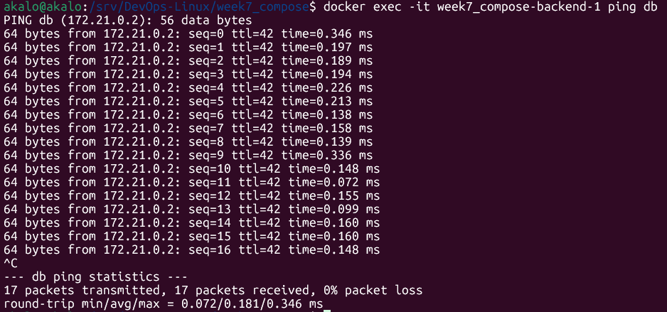

# 📘 Week 7 – Docker Compose & EC2 Deployment

This document covers all **Daily Tasks (1–7)**, the **Summary Project**, and additional **Tips & Useful Commands**.  
Each section follows the *actual chronological order you performed*: local setup → containers & health → EC2 → CI/CD.

---

<details>
<summary>📝 <strong>Daily Tasks (Task 1 → Task 7)</strong></summary>

## Task 1 – Local Setup: Install Docker, Build Images, Compose, Network & Health

### 📖 Theory
Set up Docker locally, scaffold the project, build images, define Docker Compose (backend + db), verify network (DNS) and healthchecks.

### 💻 Commands (annotated)
```bash
# 1) Install Docker Engine & Compose plugin (Ubuntu)
sudo apt update && sudo apt install -y docker.io docker-compose-plugin   # install engine + compose v2

# 2) Allow running docker without sudo (re-login required to take effect)
sudo usermod -aG docker $USER                                           # add current user to 'docker' group

# 3) Verify installation
docker --version                                                         # show Docker version
docker compose version                                                   # show Compose plugin version

# 4) Go to the local project root
cd /srv/DevOps-Linux/week7_compose                                      # change directory to Week 7 folder

# 5) (If needed) Build backend image from Dockerfile
docker compose build backend                                            # build only the backend service image

# 6) Start the multi-container app (detached)
docker compose up -d                                                    # bring up all services in the background

# 7) List running services with status and ports
docker compose ps                                                       # show containers status; 'Up (healthy)' means healthcheck passed

# 8) See recent logs to confirm startup (optional)
docker compose logs --tail 30                                           # tail last 30 log lines from all services

# 9) Verify backend is reachable locally
curl -I http://127.0.0.1:8000/                                          # HEAD request; expect HTTP/1.0 200 OK

# 10) Verify inter-container DNS resolution (backend can resolve 'db')
docker compose exec backend getent hosts db                              # should print internal IP for 'db' on app_net
```

### ✅ Expected Result
- Docker installed and usable without sudo (after re-login).
- `docker compose ps` shows: backend **Up (healthy)**, db **Up**.
- `curl -I http://127.0.0.1:8000/` returns **200 OK**.
- `getent hosts db` returns an internal IP (e.g., `172.x.x.x`).

---

## Task 2 – Persistency, Images Overview & Recreate Stack

### 📖 Theory
Use a named volume for database persistence and understand built images. Recreate the stack to prove data survives restarts.

### 💻 Commands (annotated)
```bash
# 1) List Docker images present locally
docker images                                                           # shows local images (backend + postgres)

# 2) List volumes
docker volume ls                                                        # named volumes for persistence (e.g., db_data)

# 3) Restart stack (cleanly) to validate persistency
docker compose down                                                     # stop services (keeps volumes by default)
docker compose up -d                                                    # start services again in background

# 4) Check status again
docker compose ps                                                       # verify services are Up (healthy)
```

### 📸 Screenshot


### ✅ Expected Result
- Named volume present.
- Data persists across `down`/`up` cycles.

---

## Task 3 – Healthcheck Deep Dive & Internal Communication

### 📖 Theory
`healthcheck` ensures containers are actually responsive (not just running). Validate backend health and internal DNS/networking.

### 💻 Commands (annotated)
```bash
docker ps                                                               # quick view of running containers
docker inspect $(docker compose ps -q backend) | grep -n '"Health"'     # inspect backend and filter health section
curl -I http://127.0.0.1:8000/                                          # HEAD request to backend
docker compose exec backend getent hosts db                              # confirm backend resolves 'db' over app_net
```

### 📸 Screenshot


### ✅ Expected Result
- `"Status": "healthy"` in inspect output.
- DNS resolution working between containers.

---

## Task 4 – Network & Volume Verification

### 📖 Theory
Verify Compose network (`app_net`) and persistent volume. These ensure isolated comms and durable data.

### 💻 Commands (annotated)
```bash
docker network ls                                                       # list docker networks; look for app_net
docker volume ls                                                        # list volumes; look for the named DB volume
```

### 📸 Screenshot


### ✅ Expected Result
- `app_net` network exists.
- Named volume exists and is attached to db.

---

## Task 5 – EC2 Instance Creation & SSH Access

### 📖 Theory
Provision AWS EC2 (Ubuntu, Free Tier), open SG ports (22, 8000), and connect via SSH.

### 💻 Commands (annotated)
```bash
ssh -i ~/.ssh/week7-key.pem ubuntu@<EC2_PUBLIC_IP>                      # connect to the EC2 instance
uptime                                                                  # instance load/uptime
df -h                                                                   # disk usage
free -m                                                                 # memory usage
```

### ✅ Expected Result
- SSH prompt on EC2: `ubuntu@ip-...:~$` and basic health looks good.

---

## Task 6 – Transfer Project & Run Compose on EC2

### 📖 Theory
Copy the project to EC2 and run the same Compose stack remotely.

### 💻 Commands (annotated)
```bash
# From local to EC2 (copies Week 7 only)
scp -i ~/.ssh/week7-key.pem -r /srv/DevOps-Linux/week7_compose ubuntu@<EC2_PUBLIC_IP>:~/   # transfer project

# On EC2
ssh -i ~/.ssh/week7-key.pem ubuntu@<EC2_PUBLIC_IP>                  # connect
cd ~/week7_compose                                                  # enter project folder on EC2
docker compose up -d                                                # start services in background
docker compose ps                                                   # verify 'Up (healthy)' and ports mapping (0.0.0.0:8000->8000)
```

### 📸 Screenshot


### ✅ Expected Result
- Backend available at `http://<EC2_PUBLIC_IP>:8000` from your browser.
- Services report healthy on EC2.

---

## Task 7 – CI/CD: compose-e2e (CI) and deploy (CD)

### 📖 Theory
Two workflows: **CI** (compose-e2e) validates the stack on a GitHub runner; **CD** (deploy) syncs the project to EC2 and restarts services.

### 💻 Snippets (key parts)
```yaml
# .github/workflows/compose-ci.yml  (CI)
name: compose-e2e
on:
  push:
    paths: ["week7_compose/**", ".github/workflows/compose-ci.yml"]
  pull_request:
    paths: ["week7_compose/**", ".github/workflows/compose-ci.yml"]
jobs:
  e2e:
    runs-on: ubuntu-latest
    defaults:
      run:
        working-directory: week7_compose
    steps:
      - uses: actions/checkout@v4
      - run: docker compose up -d
      - name: Wait for backend healthy
        run: |
          for i in {1..30}; do
            ID=$(docker compose ps -q backend || true)
            STATUS=$(docker inspect -f '{{.State.Health.Status}}' "$ID" 2>/dev/null || true)
            [ "$STATUS" = "healthy" ] && exit 0
            sleep 2
          done
          echo "backend not healthy"; docker compose logs backend; exit 1
      - run: curl -fsS http://localhost:8000/ -o /dev/null
      - if: always()
        run: docker compose logs --no-color | tee compose-logs.txt
      - if: always()
        uses: actions/upload-artifact@v4
        with: { name: compose-logs, path: week7_compose/compose-logs.txt }
      - if: always()
        run: docker compose down -v
```

```yaml
# .github/workflows/deploy.yml  (CD)
name: Deploy to EC2
on:
  push:
    branches: [ "main" ]
jobs:
  deploy:
    runs-on: ubuntu-latest
    steps:
      - uses: actions/checkout@v4
      - name: Copy project to EC2
        uses: appleboy/scp-action@v0.1.4
        with:
          host: ${{ secrets.EC2_HOST }}
          username: ubuntu
          key: ${{ secrets.EC2_SSH_KEY }}
          source: "week7_compose/"
          target: "~/week7_compose"
      - name: Run Docker Compose on EC2
        uses: appleboy/ssh-action@v1.1.0
        with:
          host: ${{ secrets.EC2_HOST }}
          username: ubuntu
          key: ${{ secrets.EC2_SSH_KEY }}
          script: |
            cd ~/week7_compose
            docker compose down
            docker compose up -d --build
            docker compose ps
```

### ✅ Expected Result
- CI turns green after health + smoke test.
- CD deploys to EC2 whenever you push to `main`.

</details>

---

<details>
<summary>🚀 <strong>Summary Project – Architecture & Flow</strong></summary>

### 🧠 Overview
- **Backend**: Python HTTP server (port 8000), `healthcheck` enabled.
- **Database**: PostgreSQL (port 5432).
- **Network**: Internal Docker network `app_net` (backend ↔ db).
- **Volume**: Persistent data at `/var/lib/postgresql/data`.
- **Host**: AWS EC2 (Ubuntu), SG allows 22/8000.
- **CI/CD**: GitHub Actions (`compose-e2e` → `deploy`).

### 🖼️ Architecture Diagram


### 🔁 Flow (end-to-end)
1. Developer pushes to GitHub.  
2. **CI (compose-e2e)** builds & verifies health.  
3. **CD (deploy)** copies project to EC2 and runs `docker compose up -d --build`.  
4. EC2 serves `http://<EC2_PUBLIC_IP>:8000` to users.

</details>

---

<details>
<summary>🛠 <strong>Tips, Fixes & Useful Commands</strong></summary>

### Common Issues & Fixes
```bash
# SSH key permissions
chmod 400 ~/.ssh/week7-key.pem

# Open app port (if UFW enabled)
sudo ufw allow 8000/tcp
sudo ufw status

# Cleanup (dangling images/volumes)
docker system prune -a -f
docker volume prune -f
```

### Useful Docker Commands (annotated)
```bash
docker compose up -d                     # start all services (detached)
docker compose ps                        # list services, status, health, port mappings
docker compose logs --tail 50            # last 50 log lines from all services
docker compose down -v                   # stop and remove services + volumes
docker exec -it <container> sh           # open shell inside a running container
docker inspect <container>               # detailed container information (including health)
docker images                            # list local images
docker volume ls                         # list volumes (named and anonymous)
```

### Git Basics
```bash
git add .
git commit -m "docs(week7): update README with full local flow & annotations"
git push origin main
```
</details>

---

✅ This completes **Week 7** – from local Docker setup and validation to automated EC2 deployment with Docker Compose, healthchecks, volumes, and CI/CD.
