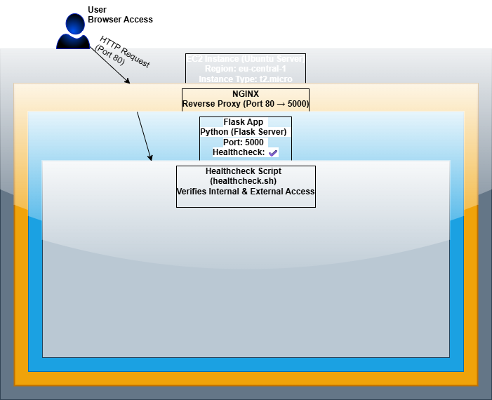

# 📦 Week 8 – Flask App Deployment on AWS EC2 (with Nginx & Healthcheck)

This document covers all setup steps for deploying a simple Flask app on an AWS EC2 instance using Nginx as a reverse proxy and a Bash script for internal & external health checks.

---

## ▶️ Daily Tasks (Step-by-step)

<details>
<summary>🛠️ Task 1 – EC2 Setup & AWS CLI</summary>

### ✅ Actions Performed:
- Created free-tier EC2 instance (`Ubuntu Server`, `t2.micro`, `eu-central-1`)
- Installed AWS CLI inside WSL2
- Created SSH key pair: `devops-key.pem`
- Configured security group: `devops-sg` (port 22, 80, 5000)

### 💻 Commands:
```bash
aws ec2 create-key-pair --key-name devops-key --query 'KeyMaterial' --output text > devops-key.pem
chmod 400 devops-key.pem
```

```bash
aws ec2 run-instances --image-id ami-XXXXXXXXXXXX --count 1   --instance-type t2.micro   --key-name devops-key   --security-groups devops-sg   --region eu-central-1
```

</details>

---

<details>
<summary>🌐 Task 2 – Install Nginx + Flask</summary>

### ✅ Actions Performed:
- Installed Python3, pip and Flask
- Created basic Flask server running on port 5000
- Installed and configured Nginx to proxy HTTP requests from port 80 → 5000

### 💻 Commands:
```bash
sudo apt update && sudo apt install python3 python3-pip nginx -y
pip install flask
```

**Flask App (app.py):**
```python
from flask import Flask
app = Flask(__name__)

@app.route('/')
def home():
    return "ברוך הבא לשרת Flask מ-AWS!"

app.run(host='0.0.0.0', port=5000)
```

**Nginx Config (`/etc/nginx/sites-available/flask-app`):**
```nginx
server {
    listen 80;
    server_name _;

    location / {
        proxy_pass http://127.0.0.1:5000;
        proxy_set_header Host $host;
        proxy_set_header X-Real-IP $remote_addr;
    }
}
```

Enable config:
```bash
sudo ln -s /etc/nginx/sites-available/flask-app /etc/nginx/sites-enabled/
sudo systemctl restart nginx
```

</details>

---

<details>
<summary>🔍 Task 3 – Healthcheck Script</summary>

### ✅ Actions Performed:
- Created Bash script `healthcheck.sh` to test Flask internally + externally.

### 💻 Script:
```bash
#!/bin/bash

echo "📡 Health Check Started..."

for URL in "http://localhost" "http://<PUBLIC-IP>"
do
  STATUS=$(curl -s -o /dev/null -w "%{http_code}" $URL)
  if [ "$STATUS" -eq 200 ]; then
    echo "✅ [$URL] OK (HTTP $STATUS)"
  else
    echo "❌ [$URL] Not OK (HTTP $STATUS)"
  fi
done
```

Make it executable:
```bash
chmod +x healthcheck.sh
```

</details>

---

<details>
<summary>🖼️ Summary Project – Architecture & Flow</summary>

### ✅ Diagram
📌 Shows full communication flow from user → EC2 → Nginx → Flask App  
(See image: `diagram_flask_architecture.png`)



</details>

---

## 🧠 Tips & Useful Notes

- Use `chmod 400 devops-key.pem` to prevent SSH permission denied.
- Use `nohup python3 app.py &` to keep Flask alive after logout.
- Configure Nginx to serve as reverse proxy so you can access Flask externally.
- Use `curl -I http://localhost` to verify HTTP status (200 OK).

---

✅ This completes **Week 8** – You now have a working EC2 deployment with Flask, Nginx, and healthchecks.

